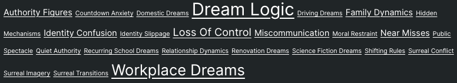
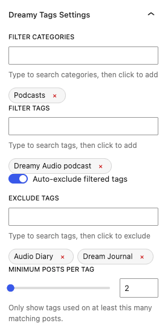

# Dreamy Tags


Dreamy Tags allows you to display a tag cloud filtered by categories and tags. It can be used via **shortcodes** or **Block Editor blocks**.



## Shortcode

```text
[dreamy_tags cat="786439348" children="true" tags="786439775" exclude="786439762,786439759" auto_exclude="true" min_count="5"]
```

All arguments are optional. 
`cat`, `tags`, and `exclude` expect numeric term IDs and are comma-delimited.

* `cat` - Category IDs a post must belong to (at least one)
* `children` - (boolean, default: true) - Include posts in child categories
* `tags` - Tag IDs a post must belong to (at least one)
* `exclude_tags` - Tag IDs excluded from the cloud
* `auto_exclude` (boolean, default: true) - Excludes filter tags from the cloud
* `min_count` - (number, default: 2) - Minimum number of occurrences a tag must appear across the filtered posts

## Block Editor



Block settings map directly to the shortcode options:

* **Filter Categories** - Post must belong to one of these categories
* **Include Children** - Posts in child-categories will be included
* **Filter Tags** - Post must have one of these tags
* **Exclude Tags** - Tags that will not appear in the cloud
* **Auto-exclude filtered tags** - Filter tags will not appear in the cloud
* **Minimum posts per tag** - Required number of appearances before a tag is shown

## Install

Install **Dreamy Tags** directly from the WordPress Plugin Directory:

1. In WordPress, go to **Plugins → Add New**
2. Search for **Dreamy Tags**
3. Click **Install**, then **Activate**

Stable releases are distributed via WordPress.org.

## Local Development

*This repository contains the source code and build tooling for the plugin.*

1. Open Terminal.
2. Navigate to your project folder
3. Make the build script executable `chmod +x build.sh`
4. Build the plugin `./build.sh --build-only`
5. Upload the generated `dreamy-tags-vX.Y.Z.zip` to a local WordPress install

### Version Bump
During development, it is encouraged to bump the version with each build and append the changelog. This is done by calling the build script with `-c` change tags. 

Multiple change tags can be defined. At least one change is required, and must be between 8-60 characters each.

This will update `CHANGELOG.md` and `dreamy-tags/readme.txt` with the changes. The version's patch number will be incremented, and updated in `readme.txt`, `dreamy-tags.php`, `block.json`

```bash
./build.sh -c "Updated documentation" -c "Fixed spelling of 'occurrences'"
```

### Stable Build

*Stable releases are published via WordPress.org*

To mark a release as stable, pass `-s` or `--stable` along with `-c` entries describing user-impacting changes.

If there are no functional changes, this is sufficient:

```bash
./build.sh -s -c "No functional changes. Safe to update."
```

This updates the Stable tag in `dreamy-tags/readme.txt` using the version in `version.txt` and adds an entry under `== Upgrade Notice ==`.
Multiple `-c` entries are supported and will be joined with semicolons.
